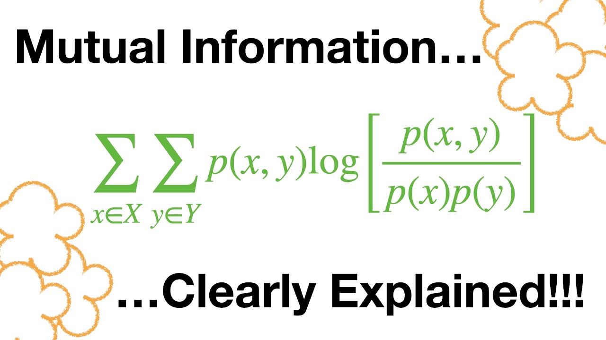

# Read dataset

* Read use spark.read.csv() method to read the dataset
* Filter for get only the columns that you need
* Create RDD immutable collection of key–value pairs of data

# First Phase

* Count words and labels    
* Compute Word-Label Pairs (((word, label), 1))
* Compute Label-Word Counts ((label, N_l))

# Second Phase

* Filtering Frequent Words
* Group by word (word, [(label, count), ...])
* Compute Word-Label Counts ((word, label, count))

# Third Phase

* Computing Mutual Information (MI) (word, [(label1, MI1), (label2, MI2), ...])
* 